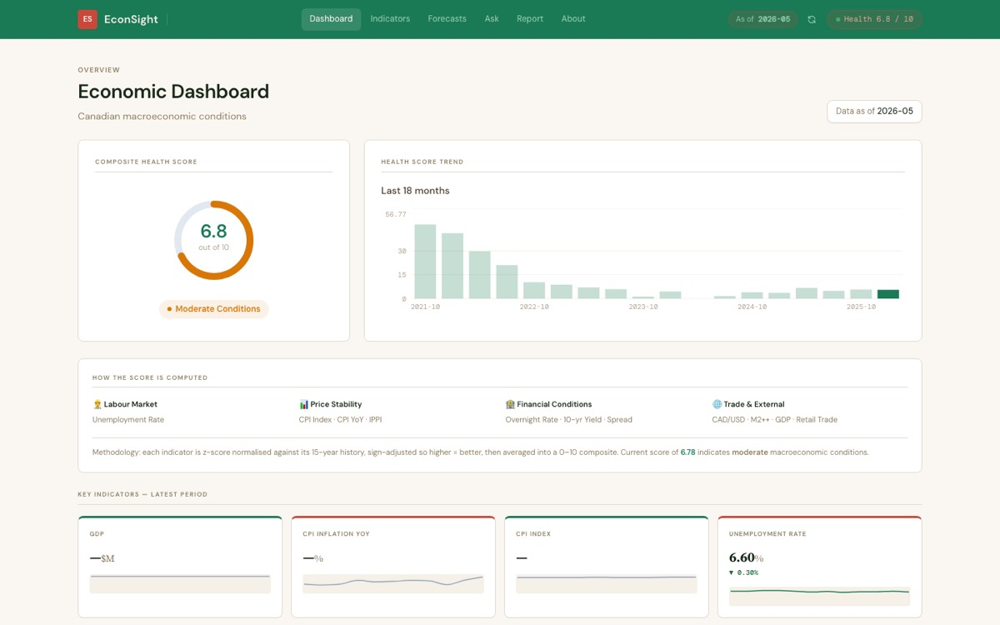

# EconSight

[](https://github.com/kbaran011/EconSight/actions/workflows/ci.yml)
[](https://frontend-production-f45a3.up.railway.app)

**Full-stack Canadian economic intelligence platform** — live macro data, VAR/XGBoost forecasts, RAG Q&A, and a consulting-grade dashboard.

**Live demo:** [frontend-production-f45a3.up.railway.app](https://frontend-production-f45a3.up.railway.app)



---

## What It Does

Ingests 9 macro indicators from Statistics Canada and the Bank of Canada into a PostgreSQL medallion warehouse (Bronze → Silver → Gold), runs VAR/VECM and XGBoost forecasting with Monte Carlo scenario bands, and serves the results through a FastAPI + React interface with a composite economic health score, natural language Q&A (RAG), and PDF report generation.

## Stack

| Layer | Tech |
|---|---|
| Data | Python · PostgreSQL 16 · httpx async · psycopg3 |
| Models | statsmodels (VAR/VECM) · XGBoost · SHAP · scikit-learn |
| Backend | FastAPI · ChromaDB · sentence-transformers · WeasyPrint |
| AI | Llama 3.3-70b via Groq · RAG (SQL + semantic routing) |
| Frontend | React · TypeScript · Tailwind CSS · Recharts · TanStack Query |
| DevOps | Docker Compose · GitHub Actions CI · Railway |

## Architecture

```text
src/econsight/
├── clients/        # StatCan + Bank of Canada API clients (async httpx)
├── db/             # schema.sql, loader, seed — Bronze → Silver → Gold warehouse
├── models/         # VAR/VECM, XGBoost, Monte Carlo bands, SHAP, composite health score
├── rag/            # ingestion, retriever, query engine (SQL + semantic routing)
├── report/         # WeasyPrint executive brief + full PDF report
├── api/            # FastAPI app + routers: indicators, forecasts, rag, report, export, status
└── pipeline.py     # end-to-end orchestration

frontend/           # React + TypeScript SPA (Dashboard, Indicators, Forecasts, Ask, Report)
sql/                # database bootstrap
powerbi/            # BI tool connection guide
notebooks/          # analysis notebook (also the RAG corpus)
tests/              # 69-test pytest suite, run in CI on every push
```

## Quick Start

```bash
cp .env.docker.example .env.docker
# Add GROQ_API_KEY from console.groq.com (free)
docker compose --env-file .env.docker up --build
```

Open **http://localhost**. Data fetches and models train in the background (~3–8 min on first boot).

## Key Features

- **Composite health score** — 10 z-score normalised indicators averaged to a 0–10 index, updated monthly
- **12-month forecasts** — XGBoost point estimates with P10/P90 Monte Carlo bands and upside/downside scenarios
- **RAG Q&A** — routes natural language questions to either live SQL queries or semantic search over the analysis notebook
- **PDF report** — one-click executive brief via WeasyPrint
- **69 tests** — pytest suite covering clients, loader, and API; full CI on every push

## Power BI / BI Tool Integration

Live data is accessible to any BI tool via public CSV endpoints — no database credentials required.

| Tool | Connection |
|---|---|
| Power BI Desktop | Get Data → Web → paste endpoint URL |
| Excel | Data → From Web → paste endpoint URL |
| IBM Cognos | Manage → Data server connections → REST |
| Tableau | Web Data Connector → paste URL |

**Endpoints (no auth required):**
- `GET /api/export/indicators.csv` — full macro mart (13 columns, 36 months)
- `GET /api/export/health-score.csv` — composite score history
- `GET /api/export/forecasts.csv` — VAR/XGBoost forecasts with scenario bands

See [`powerbi/README.md`](powerbi/README.md) for step-by-step connection instructions.

## Why I built this

I study CS and Economics, and I wanted the two to meet in something real: a system that treats macro data with the same engineering discipline as production software — a proper warehouse instead of one-off CSV pulls, models with honest uncertainty bands instead of single-point forecasts, and an interface a non-technical reader can actually use. Building it end to end (ingestion → warehouse → models → API → frontend → PDF) was the point.

## What I'd Add at Scale

- Airflow for orchestration with SLA monitoring
- Redis to cache hot API endpoints
- Alembic for versioned schema migrations
- Playwright E2E tests in CI
